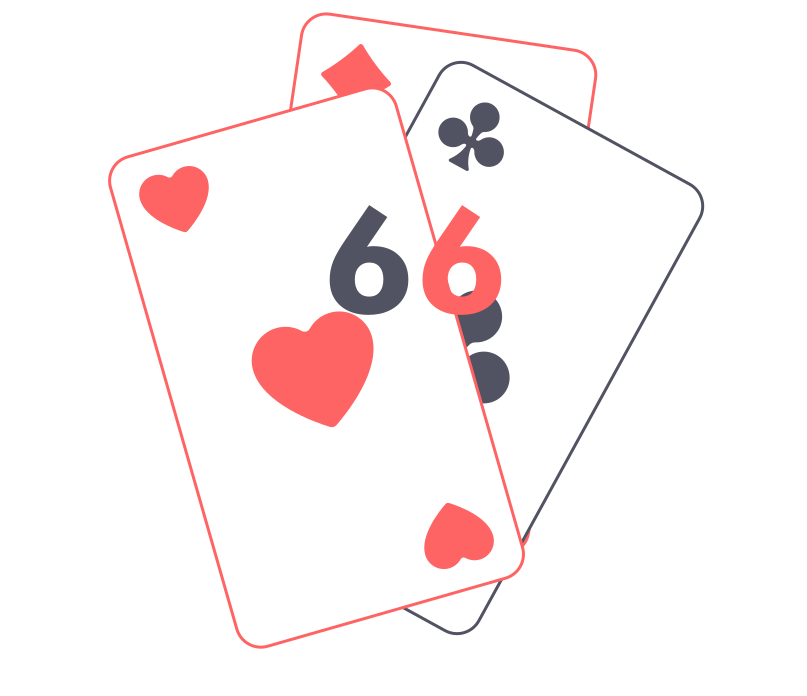
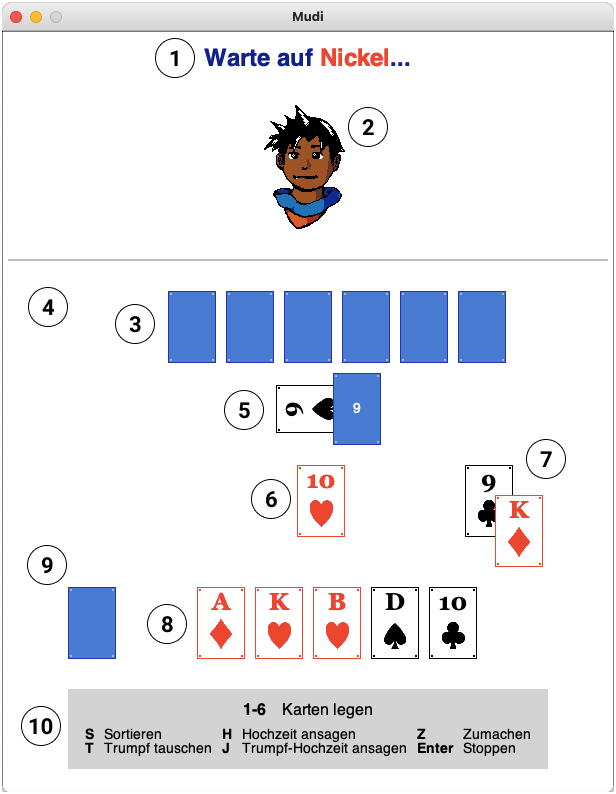
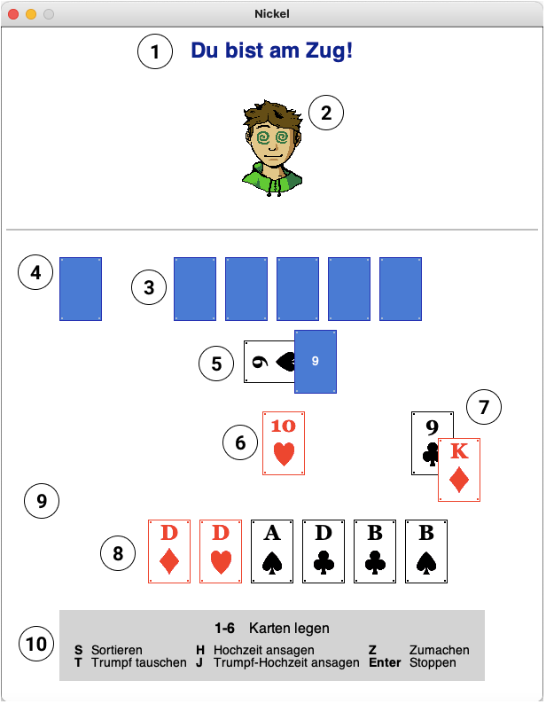
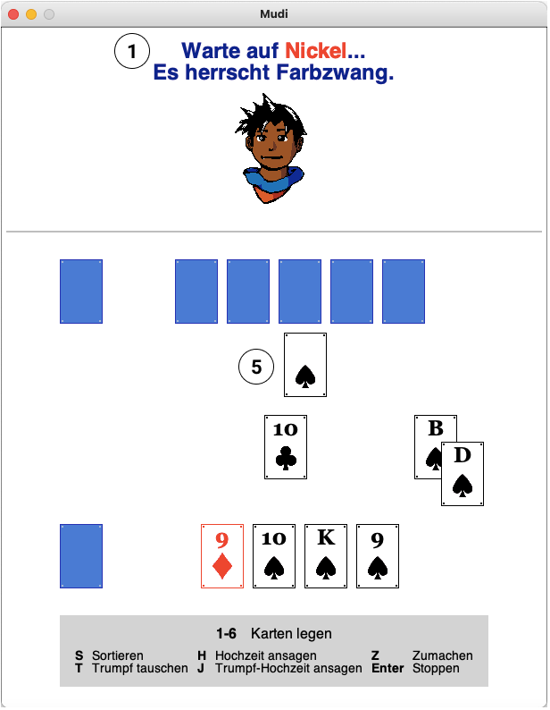
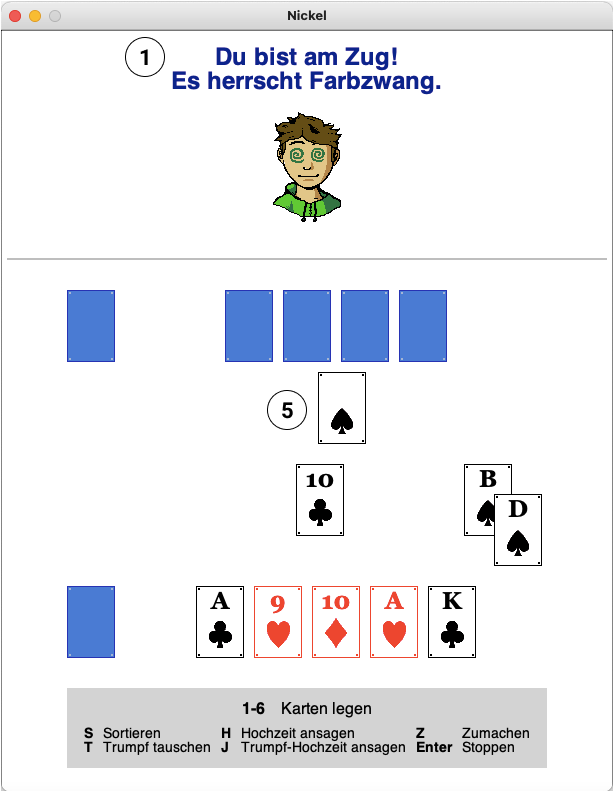
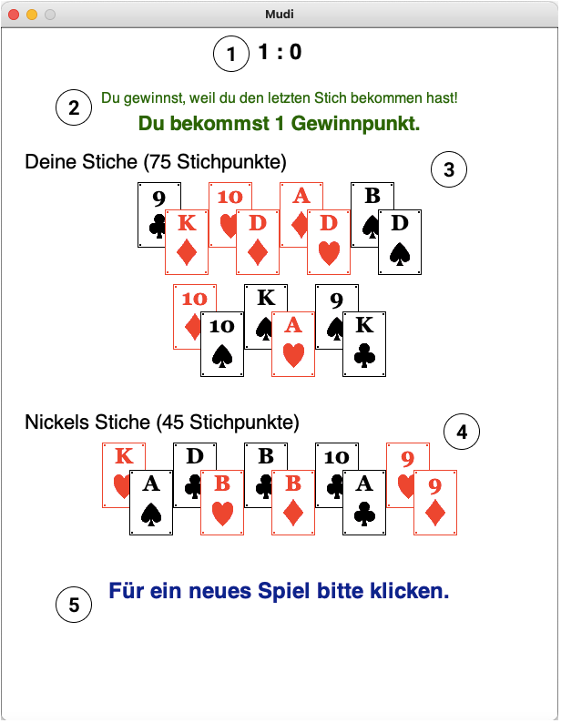
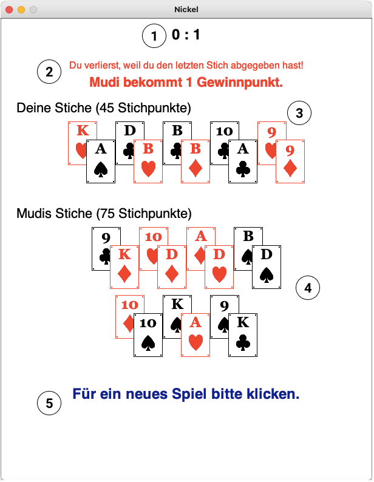

# 
 Sechsundsechzig (66) – Benutzerhandbuch 

 

##  Inhaltsverzeichnis
1. [Spielverlauf](#spielverlauf)
2. [Spielzüge](#spielzuege)
    - [Karte legen](#legen)
	- [Offene Trumpfkarte austauschen](#tauschen)
	- [Pärchen ansagen](#ansagen)
	- [Deck zumachen](#zumachen)
	- [Stoppen](#stoppen)
	- [Karten sortieren](#sortieren)
3. [Registrierung](#registrierung)
4. [Gewinnpunkte](#gewinnpunkte)
5. [Beispiele](#beispiele)
	- [Regulär](#regulaer)
	- [Kein Deck mehr](#kein-deck)
	- [Ende](#ende)
        
##  Spielverlauf <a name="spielverlauf"/>
Sechsundsechzig ist ein Zweispieler-Kartenspiel. Es werden 24 Karten benutzt: 9, Bube, Dame, König, 10 und Ass von jeder Farbe einmal. Dabei gibt es ...
- 0 Punkte für 9,
- 2 Punkte für Bube,
- 3 Punkte für Dame,
- 4 Punkte für König,
- 10 Punkte für 10 und
- 11 Punkte für Ass. 

Man beginnt mit 6 Karten in der Hand. Die offene Karte unter dem Deck gibt an, welche Farbe die Trumpffarbe ist. Es beginnt der erste Spieler. Das Ziel des Spiels ist es, durch gewonnene Stiche, 66 Punkte oder mehr zu erreichen, bevor es der Gegner schafft. Sobald man 66 Punkte oder mehr erreicht hat, muss man Stopp sagen, um zu gewinnen. Nachdem alle Karten gespielt wurden oder nach Stoppen des Spiels werden die Gewinnpunkte vergeben (siehe [Gewinnpunkte](#gewinnpunkte)).

Jede Runde legen beide Spieler nacheinander eine Karte in die Mitte. Der Gewinner des letzten Stichs darf als erstes legen. Einen Stich gewinnt man, indem man eine höhere Karte derselben Farbe oder eine Karte der Trumpffarbe auf die gegnerische Karte legt. Hat der Gegner auch eine Karte der Trumpffarbe gelegt, gewinnt derjenige, der die höhere Karte gelegt hat, den Stich. Ansonsten bekommt der Gegner den Stich. Danach wird jeweils eine Karte vom Deck gezogen, solange es noch Karten im Deck gibt – die weiter oben liegende Karte im Deck bekommt Gewinner des Stichs. Die Stichpunkte setzen sich aus den Punkten der beiden Karten zusammen.

Solange es noch Karten im Deck gibt, kann man jede beliebige Karte legen. Wenn das Deck leer ist oder zugemacht wurde (s.u.), muss man bedienen. Das heißt, falls man als zweites eine Karte in die Mitte legt, muss diese die gleiche Farbe haben wie die vom Gegner als erstes in die Mitte gelegte Karte. Falls man keine Karte derselben Farbe hat, darf man eine beliebige Karte legen.

Je nachdem, ob man als erstes oder als zweites spielt, darf man folgende Spielzüge ausführen: Karte legen (beliebige Karte als erstes, nach Spielregeln als zweites), Offene Karte unter dem Deck austauschen (als erstes oder als zweites), Ein Pärchen ansagen (nur als erstes), Zumachen (nur als erstes), Stoppen (nur als erstes), Sortieren (immer). Diese Spielzüge werden nun näher erklärt mit den jeweiligen Tasten, die man dafür drücken muss.

##  Spielzüge <a name="spielzuege"/>
### Karte legen (`1`, `2`, `3`, `4`, `5`, `6`)  <a name="legen"/>
Eine Karte in die Mitte legen gemäß den oben genannten Spielregeln.

### Offene Trumpfkarte austauschen (`T`) <a name="tauschen"/>
Falls man die 9 der Trumpffarbe hat und mehr als 2 Karten im Deck sind (also mehr als eine verdeckte Karte), dann kann man die offene Trumpfkarte im Deck durch seine eigene Trumpf 9 austauschen. Dies kostet keinen Zug, man ist immer noch dran und kann einen anderen Spielzug ausführen.

### Pärchen ansagen (`H`, `J`) <a name="ansagen"/>
Ein Pärchen (oder _eine Hochzeit_) ansagen ist nur möglich, falls man den König und die Dame von der gleichen Farbe besitzt. Für die Ansage des Trumpfpärchens drückt man `J` und für ein Pärchen der drei anderen Farben `H`. Man bekommt 30 Stichpunkte fürs Ansagen einer Trumpf-Hochzeit und 20 Punkte eine reguläre Hochzeit. Dies kostet keinen Zug, aber falls man danach legen will, *muss* es eine Karte des Pärchens sein.

### Deck zumachen (`Z`) <a name="zumachen"/>
Wenn man das Gefühl hat, mit den Karten, die man zur Zeit auf der Hand hat, 66 Punkte erreichen zu können, kann man zumachen. Das Deck wird “geschlossen” und es werden keine Karten mehr nachgezogen.

### Stoppen (`Enter`) <a name="stoppen"/>
Wenn man Stopp ruft, beendet man das Spiel. Man stoppt nur, wenn man denkt, dass man selber 66 oder mehr Stichpunkte hat. Man darf unmittelbar nach Ansage einer Hochzeit Stopp sagen.

### Karten sortieren (`S`) <a name="sortieren"/>
Sortieren darf man immer und es kostet auch keinen Zug. Die Karten werden nach Farbe – erst Kreuz, dann Pik, dann Herz, dann Karo – und absteigend nach Kartenwert sortiert.

## Gewinnpunkte <a name="gewinnpunkte"/>
Hat der Spieler, der Stopp gesagt hat, wirklich 66 Sichpunkte oder mehr erreicht, bekommt er ...
- 1 Gewinnpunkt, falls der Gegner mehr als 32 Stichpunkte hat.
- 2 Gewinnpunkte, falls der Gegner mindestens einen Stich gewonnen und maximal 32 Stichpunkte hat.
- 3 Gewinnpunkte, falls der Gegner keine Stiche gewonnen hat (ein Null-Punkte-Stich – z.B. Kreuz 9 und Herz 9 – gilt als ein Stich!).

Sagt man Stopp, ohne 66 Stichpunkte erreicht zu haben, bekommt der Gegner 3 Gewinnpunkte.
Falls kein Spieler stoppt, entscheidet der allerletzte Stich. Der Gewinner des Stichs bekommt 1 Gewinnpunkt unabhängig davon, wieviele Stichpunkte gesammelt wurden. Die Gewinnpunkte werden über alle Runden mitgezählt – normalerweise wird gespielt bis einer 8 Gewinnpunkte erreicht hat, doch man kann auch länger spielen oder früher aufhören, falls man das möchte.

##  Registrierung <a name="registrierung"/>
Um das Spiel spielen zu können, muss man erst das Spieluniversum auf einem Server starten und sich dann _registrieren_. Dazu muss man in der `create-wrld`-Funktion der `world.rkt`-Datei den entsprechenden Server bei `register` und den Port bei `port` eingeben. Die eigene Spielwelt wird dann mit dem Aufruf dieser Funktion erstellt, z.B.: `(create-wrld "Max")`. Beide Spieler müssen verschiedene Namen benutzen, ansonsten kann es zu Fehlern kommen!

##  Beispiele <a name="beispiele"/>
Nun werden einige Beispielszenarien von dem Spiel gezeigt zur Veranschaulichung des Spiels und der Darstellung. In diesen Beispielszenarien spielen _Mudi_ (links) und _Nickel_ (rechts) gegeneinander.

### Regulär <a name="regulaer"/>

 

1. Die Statusanzeige: _Mudi_ hat zuvor eine _Herz 10_ in die Mitte gelegt und wartet nun auf _Nickel_, der dran ist.
2. Der eigene Spielersprite mit entsprechenden Reaktionen auf Stichgewinn oder -verlust.
3. Die umgedrehten Handkarten des gegnerischen Spielers.
4. Die gegnerischen Stiche: Eine umgedrehte Karte symbolisiert mindestens einen gewonnen Stich, sonst ist dieses Feld leer.
5. Das Deck. Es gibt noch 9 verdeckte Karten; die offene Karte _Kreuz 9_ gibt die Trumpffarbe an und wird als allerletztes gezogen.
6. Die Mitte. Zurzeit liegt die _Herz 10_ in der Mitte. _Nickel_ ist am Zug – er hat keine höhere Karte der Farbe Herz, aber könnte den Stich gewinnen, indem er eine seiner Trumpfkarten (`3` oder `6`) legt.
7. Der zuletzt gewonnene Stich. 
8. Die eigenen Handkarten.
9. Die eigenen Stiche: Eine umgedrehte Karte symbolisiert mindestens einen gewonnen Stich, sonst ist dieses Feld leer.
9. Die Tastenbedienung für alle Spielzüge.

### Kein Deck mehr <a name="kein-deck"/>

 

1. Die Statusanzeige: zusätzlich zum vorigen Beispiel wird hier auch angezeigt, dass gerade Stichzwang herrscht.
2. Die Trumpffarbe. Wenn das Deck leer ist, kann man die offene Karte nicht mehr sehen, die Trumpf angibt – deswegen wird die Trumpffarbe hier abgebildet.

### Ende <a name="ende"/>

 

1. Die Gewinnpunkte über alle Runden hinweg. Als erstes stehen die eigenen Gewinnpunkte, dann die vom Gegner.
2. Gewinn- oder Verliernachricht. Außerdem steht dort, wieviele Gewinnpunkte man für die eben beendete Runde bekommt.
3. Alle Stiche, die man gewonnen hat und die Stichpunkte dafür.
4. Alle Stiche, die der Gegner gewonnen hat und die Stichpunkte dafür.
5. Um ein neues Spiel zu starten, muss man klicken.
