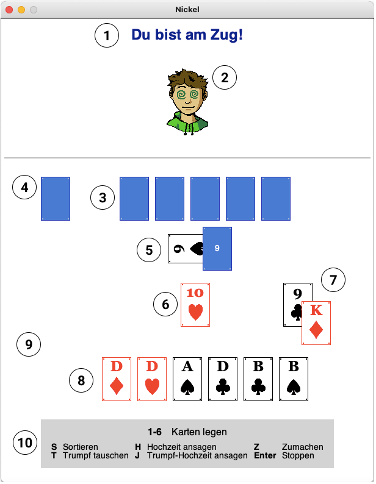
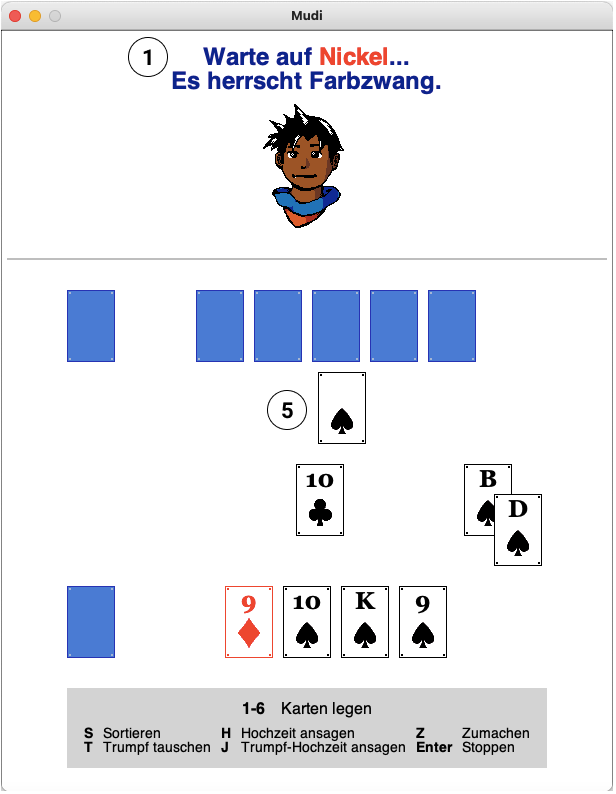

# 
 Sechsundsechzig (66) – Benutzerhandbuch 

##  Inhaltsverzeichnis
1. [Spielverlauf](#spielverlauf)
2. [Spielzüge](#spielzuege)
    - [Karte legen](#legen)
	- [Offene Trumpfkarte austauschen](#tauschen)
	- [Pärchen ansagen](#ansagen)
	- [Deck zumachen](#zumachen)
	- [Stoppen](#stoppen)
	- [Karten sortieren](#sortieren)
3. [Registrierung](#registrierung)
4. [Gewinnpunkte](#gewinnpunkte)
5. [Beispiele](#beispiele)
	- [Regulär](#regulaer)
	- [Kein Deck mehr](#kein-deck)
	- [Ende](#ende)

##  Spielverlauf <a name="spielverlauf"/>
Sechsundsechzig ist ein Zweispieler-Kartenspiel. Es werden 24 Karten benutzt: 9, Bube, Dame, König, 10 und Ass von jeder Farbe einmal. Dabei gibt es ...
- 0 Punkte für 9,
- 2 Punkte für Bube,
- 3 Punkte für Dame,
- 4 Punkte für König,
- 10 Punkte für 10 und
- 11 Punkte für Ass.

Man beginnt mit 6 Karten in der Hand. Die offene Karte unter dem Deck gibt an, welche Farbe die Trumpffarbe ist. Es beginnt der erste Spieler. Das Ziel des Spiels ist es, durch gewonnene Stiche, 66 Punkte oder mehr zu erreichen, bevor es der Gegner schafft. Sobald man 66 Punkte oder mehr erreicht hat, muss man Stopp sagen, um zu gewinnen. Nachdem alle Karten gespielt wurden oder nach Stoppen des Spiels werden die Gewinnpunkte vergeben (siehe [Gewinnpunkte](#gewinnpunkte)).

Jede Runde legen beide Spieler nacheinander eine Karte in die Mitte. Der Gewinner des letzten Stichs darf als erstes legen. Einen Stich gewinnt man, indem man eine höhere Karte derselben Farbe oder eine Karte der Trumpffarbe auf die gegnerische Karte legt. Hat der Gegner auch eine Karte der Trumpffarbe gelegt, gewinnt derjenige, der die höhere Karte gelegt hat, den Stich. Ansonsten bekommt der Gegner den Stich. Danach wird jeweils eine Karte vom Deck gezogen, solange es noch Karten im Deck gibt – die weiter oben liegende Karte im Deck bekommt Gewinner des Stichs. Die Stichpunkte setzen sich aus den Punkten der beiden Karten zusammen.

Solange es noch Karten im Deck gibt, kann man jede beliebige Karte legen. Wenn das Deck leer ist oder zugemacht wurde (s.u.), muss man bedienen. Das heißt, falls man als zweites eine Karte in die Mitte legt, muss diese die gleiche Farbe haben wie die vom Gegner als erstes in die Mitte gelegte Karte. Falls man keine Karte derselben Farbe hat, darf man eine beliebige Karte legen.

Je nachdem, ob man als erstes oder als zweites spielt, darf man folgende Spielzüge ausführen: Karte legen (beliebige Karte als erstes, nach Spielregeln als zweites), Offene Karte unter dem Deck austauschen (als erstes oder als zweites), Ein Pärchen ansagen (nur als erstes), Zumachen (nur als erstes), Stoppen (nur als erstes), Sortieren (immer). Diese Spielzüge werden nun näher erklärt mit den jeweiligen Tasten, die man dafür drücken muss.

##  Spielzüge <a name="spielzuege"/>
### Karte legen (`1`, `2`, `3`, `4`, `5`, `6`)  <a name="legen"/>
Eine Karte in die Mitte legen gemäß den oben genannten Spielregeln.

### Offene Trumpfkarte austauschen (`T`) <a name="tauschen"/>
Falls man die 9 der Trumpffarbe hat und mehr als 2 Karten im Deck sind (also mehr als eine verdeckte Karte), dann kann man die offene Trumpfkarte im Deck durch seine eigene Trumpf 9 austauschen. Dies kostet keinen Zug, man ist immer noch dran und kann einen anderen Spielzug ausführen.

### Pärchen ansagen (`H`, `J`) <a name="ansagen"/>
Ein Pärchen (oder _eine Hochzeit_) ansagen ist nur möglich, falls man den König und die Dame von der gleichen Farbe besitzt. Für die Ansage des Trumpfpärchens drückt man `J` und für ein Pärchen der drei anderen Farben `H`. Man bekommt 30 Stichpunkte fürs Ansagen einer Trumpf-Hochzeit und 20 Punkte eine reguläre Hochzeit. Dies kostet keinen Zug, aber falls man danach legen will, *muss* es eine Karte des Pärchens sein.

### Deck zumachen (`Z`) <a name="zumachen"/>
Wenn man das Gefühl hat, mit den Karten, die man zur Zeit auf der Hand hat, 66 Punkte erreichen zu können, kann man zumachen. Das Deck wird “geschlossen” und es werden keine Karten mehr nachgezogen.

### Stoppen (`Enter`) <a name="stoppen"/>
Wenn man Stopp ruft, beendet man das Spiel. Man stoppt nur, wenn man denkt, dass man selber 66 oder mehr Stichpunkte hat. Man darf unmittelbar nach Ansage einer Hochzeit Stopp sagen.

### Karten sortieren (`S`) <a name="sortieren"/>
Sortieren darf man immer und es kostet auch keinen Zug. Die Karten werden nach Farbe – erst Kreuz, dann Pik, dann Herz, dann Karo – und absteigend nach Kartenwert sortiert.

## Gewinnpunkte <a name="gewinnpunkte"/>
Hat der Spieler, der Stopp gesagt hat, wirklich 66 Sichpunkte oder mehr erreicht, bekommt er ...
- 1 Gewinnpunkt, falls der Gegner mehr als 32 Stichpunkte hat.
- 2 Gewinnpunkte, falls der Gegner mindestens einen Stich gewonnen und maximal 32 Stichpunkte hat.
- 3 Gewinnpunkte, falls der Gegner keine Stiche gewonnen hat (ein Null-Punkte-Stich – z.B. Kreuz 9 und Herz 9 – gilt als ein Stich!).

Sagt man Stopp, ohne 66 Stichpunkte erreicht zu haben, bekommt der Gegner 3 Gewinnpunkte.
Falls kein Spieler stoppt, entscheidet der allerletzte Stich. Der Gewinner des Stichs bekommt 1 Gewinnpunkt unabhängig davon, wieviele Stichpunkte gesammelt wurden. Die Gewinnpunkte werden über alle Runden mitgezählt – normalerweise wird gespielt bis einer 8 Gewinnpunkte erreicht hat, doch man kann auch länger spielen oder früher aufhören, falls man das möchte.

##  Registrierung <a name="registrierung"/>
Um das Spiel spielen zu können, muss man erst das Spieluniversum auf einem Server starten und sich dann _registrieren_. Dazu muss man in der `create-wrld`-Funktion der `world.rkt`-Datei den entsprechenden Server bei `register` und den Port bei `port` eingeben. Die eigene Spielwelt wird dann mit dem Aufruf dieser Funktion erstellt, z.B.: `(create-wrld "Max")`. Beide Spieler müssen verschiedene Namen benutzen, ansonsten kann es zu Fehlern kommen!

##  Beispiele <a name="beispiele"/>
Nun werden einige Beispielszenarien von dem Spiel gezeigt zur Veranschaulichung des Spiels und der Darstellung. In diesen Beispielszenarien spielen _Mudi_ (links) und _Nickel_ (rechts) gegeneinander.

### Regulär <a name="regulaer"/>

1. Die Statusanzeige: _Mudi_ hat zuvor eine _Herz 10_ in die Mitte gelegt und wartet nun auf _Nickel_, der dran ist.
2. Der eigene Spielersprite mit entsprechenden Reaktionen auf Stichgewinn oder -verlust.
3. Die umgedrehten Handkarten des gegnerischen Spielers.
4. Die gegnerischen Stiche: Eine umgedrehte Karte symbolisiert mindestens einen gewonnen Stich, sonst ist dieses Feld leer.
5. Das Deck. Es gibt noch 9 verdeckte Karten; die offene Karte _Kreuz 9_ gibt die Trumpffarbe an und wird als allerletztes gezogen.
6. Die Mitte. Zurzeit liegt die _Herz 10_ in der Mitte. _Nickel_ ist am Zug – er hat keine höhere Karte der Farbe Herz, aber könnte den Stich gewinnen, indem er eine seiner Trumpfkarten (`3` oder `6`) legt.
7. Der zuletzt gewonnene Stich.
8. Die eigenen Handkarten.
9. Die eigenen Stiche: Eine umgedrehte Karte symbolisiert mindestens einen gewonnen Stich, sonst ist dieses Feld leer.
9. Die Tastenbedienung für alle Spielzüge.

### Kein Deck mehr <a name="kein-deck"/>

1. Die Statusanzeige: zusätzlich zum vorigen Beispiel wird hier auch angezeigt, dass gerade Stichzwang herrscht.
2. Die Trumpffarbe. Wenn das Deck leer ist, kann man die offene Karte nicht mehr sehen, die Trumpf angibt – deswegen wird die Trumpffarbe hier abgebildet.

### Ende <a name="ende"/>

1. Die Gewinnpunkte über alle Runden hinweg. Als erstes stehen die eigenen Gewinnpunkte, dann die vom Gegner.
2. Gewinn- oder Verliernachricht. Außerdem steht dort, wieviele Gewinnpunkte man für die eben beendete Runde bekommt.
3. Alle Stiche, die man gewonnen hat und die Stichpunkte dafür.
4. Alle Stiche, die der Gegner gewonnen hat und die Stichpunkte dafür.
5. Um ein neues Spiel zu starten, muss man klicken.

# 
 Sechsundsechzig (66) – Entwicklerhandbuch 

##  Inhaltsverzeichnis
1. [Einleitung](#einleitung)
2. [Module](#modules)
    1. [World & Universe](#world-and-universe)
        - [Spielzustand](#game-state)
        - [World](#world)
            1. [On-Receive](#on-receive)
            2. [On-Key](#on-key)
            3. [On-Mouse](#on-mouse)
        - [Universe](#universe)
            1. [On-New](#on-new)
            2. [On-Msg](#on-msg)
    2. [Zugverarbeitung](#zugverarbeitung)
    3. [Daten](#daten)
        - [Card](#card)
        - [Card-Sexp](#card-sexp)
    4. [Hilfsmodule](#hilfsmodule)
        - [Predicate](#predicate)
        - [Accessor](#accessor)
    5. [Rendering](#rendering)
        - [Graphics](#graphics)
        - [Render](#render)
2. [Erweiterungen](#erweiterungen)

##  Einleitung <a name="einleitung"/>
Bei <b>Sechsundsechzig</b> handelt es sich um ein Kartenspiel, das von genau zwei Spielern gespielt werden kann (für Spielregeln und Spielablauf, siehe [Benutzerhandbuch](https://git.informatik.uni-hamburg.de/sav/fpprak21/gruppe-ballers/-/blob/master/benutzerhandbuch/Benutzerhandbuch.md)). Das Programm ist in der Programmiersprache <b>Racket</b> geschrieben und nutzt das `2htdp/universe` Teachpack für eine interaktive und grafische Umsetzung des Kartenspiels.

##  Module <a name="modules"/>
Es wurden verschiedene Module programmiert, die bestimmte Aufgaben erfüllen. Abb. 1 gibt eine grobe Übersicht dieser Module.

<b>Abb. 1:</b> Innere Struktur des Programms

Im Folgenden werden diese Module und ihre Aufgaben näher erklären.

### 
 <b> World & Universe</b> 
 <a name="world-and-universe"/>
Welt und Universum sind das Kernstück des Programms. Die Welt stellt die Client-Seite dar, während das Universum der Server ist. Welt und Universum kommunizieren mithilfe von Packages (Client-Seite) und Bundles bzw. genauer: Mails (Server-Seite). Packages werden mit `make-package`, Bundles mit `make-bundle` und Mails mit `make-mail` erstellt.

Die Spielkarten werden einerseits als <b>`card`</b>, ein selbsterstelltes `struct` (Welt), und andererseits als <b>`S-Expression`</b> in Form einer `List`, die aus `Strings` und `Numbers` besteht (Universum) dargestellt ([siehe Daten](#daten)). Eine Umwandlung der Karten von `S-Expression` zu `card` ist nötig, da `structs` nicht durch Packages und Bundles verschickt werden können und das Universum ausschließlich `S-Expression` zur Kartendarstellung nutzt. Das heißt, die Welt muss diese `S-Expression` erst zu `card` decodieren.

##### <b>`Spielzustand`</b> <a name="game-state"/>
Die Spielzustände spielen eine wichtige Rolle bei der Kommunikation zwischen Welt und Universum, da mithilfe dieses Zustands entschieden wird, welche Aktionen der Client ausführen darf, daher die Einteilung dieser Zustände in <b>spielend</b>, <b>wartend</b>, <b>gewinnend</b> und <b>verlierend</b>. Von der Sorte <b>automatisierte Zustände</b> gibt es nur `'waitStich` – dieser ist ein automatisierter Zustand, da unmittelbar nach Empfang eines Weltzustands, das diesen Spielzustand erhält, ein neues Package verschickt wird, das die Welt in den decodierten Weltzustand der Nachricht vom Universum versetzt und die Nachricht `('decideStich [mitte] [state])` an das Universum verschickt. Das Universum schickt folgende Spielzustände an die Welt.
- Spielende Zustände: `'won`, `'forceWon`, `'play`, `'forcePlay`, `'announce`, `'forceAnnounce`, `'announceTrump` `'forceAnnounceTrump`
- Wartende Zustände: `'lost`, `'forceLost`, `'wait`, `'forceWait`, `'listen`,  `'forceListen`, `listenTrump`, `'forceListenTrump`
- Automatisierte Zustände: `'waitStich`
- Gewinnende Zustände: `'Won3t`, `'cWon3t`, `'cWon3f`, `'Won3f`, `'Won2t`, `'cWon2t`, `'Won1t`, `'cWon1t`, `'wonLast`
- Verlierende Zustände: `'Lost3t`, `'cLost3t`, `'cLost3f`, `'Lost3f`, `'Lost2t`, `'cLost2t`, `'Lost1t`, `'cLost1t`, `'lostLast`

Die Zustandsnamen sind größtenteils selbsterklärend. Die gewinnenden und verlierenden Zuständen erhalten _Flags_ in ihren Namen, die bestimmte Bedeutungen haben: Die Zahl (`3`, `2` oder `1`) steht für die Gewinnpunkte des Clients (falls es ein `Won`-Zustand ist) bzw. des gegnerischen Spielers (falls es ein `Lost`-Zustand ist). `t` heißt, dass der Spieler, der gestoppt hat, mehr als 66 Stichpunkte erreicht hat; `f` heißt, dass er weniger als 66 Stichpunkte erreicht hat. und `c` sagt an, dass der Client das Deck geschlossen hat.

#### <b>World</b> <a name="world"/>

Für jeden Client gibt es eine eigene Spielwelt. Der Weltzustand ist eine `List`, die aus 15 Elementen besteht. Diese werden mithilfe der jeweiligen Event-Handler nach jedem Zug aktualisiert.

\# | Zustand | Typ | Beschreibung
:------------- | :------------- | :------------- | :------------
1 | Spielzustand | `Symbol` | Momentaner Spielzustand der Welt (siehe [Spielzustand](#game-state)).
2 | Hand (P1) | `List<card>` | Handkarten von Spieler 1.   Die Liste besteht zu jedem Zeitpunkt aus 0-6 Karten.
3 | Hand (P2) | `List<card>` | Handkarten von Spieler 2.   Die Liste besteht zu jedem Zeitpunkt aus 0-6 Karten.
4 | Stiche (P1) | `List<List<card>>` | Alle gewonnenen Stiche von Spieler 1. Ein Stich besteht immer aus genau 2 Karten.
5 | Stichpunkte (P1) | `Number` | Der Wert aller von Spieler 1 gesammelten Stiche, ggf. mit Ansagepunkten.
6 | Stiche (P2) | `List<List<card>>` | Alle gewonnenen Stiche von Spieler 1. Ein Stich besteht immer aus genau 2 Karten.
7 | Stichepunkte (P2) | `Number` | Der Wert aller von Spieler 2 gesammelten Stiche, ggf. mit Ansagepunkten.
8 | Mitte | `List<card>` | In der Mitte liegende Karten. Es liegen immer zwischen 0 und 2 Karten in der Mitte.
9 | Deck | `List<card>` | Alle Karten, die noch im Deck vorhanden sind. Zu keinem Zeitpunkt gibt es Überschneidungen zwischen Deck, Hand (P1) und Hand (P2).
10 | Letzter Stich | `List<card>` | Der zuletzt entschiedene Stich.
11 | Wer hat zugemacht? | `Symbol` | Der Spieler, der das Deck zugemacht hat: `'p0` (keiner), `'p1` (P1) oder `'p2` (P2)
12 | Gewinnpunkte (P1) | `Number` | Gewinnpunkte von Spieler 1 über alle Partien hinweg.
13 | Gewinnpunkte (P2) | `Number` | Gewinnpunkte von Spieler 2 über alle Partien hinweg.
14 | Trumpffarbe | `String` | Die Farbe, die in dem momentanen Spiel Trumpf ist: `"Kreuz"`, `"Pik"`, `"Herz"`, `"Karo"`
15 | Spielernamen | `List` | Spielernamen der spielenden Clients

Der <b>Anfangszustand der Welt</b> ist `'('wait empty-hand empty-hand '() 0 '() 0 '() '() '() 'p0 0 0 "")`, wobei `empty-hand` eine Platzhalter-Variable ist.

Die Welt nutzt drei Event-handler: `on-receive`, `on-key` und `on-mouse`. Auf gültige Client-Inputs reagieren die letzteren beiden und erstellen ggf. ein Package. Dieses enthält einen Weltzustand (generell wird der alte Weltzustand beibehalten, da das Universum für die Zugverarbeitung zuständig ist und der neue Weltzustand somit von den Mails des Universums erhalten wird) und eine Nachricht im `List`-Format bestehend aus einem `Symbol` (Spielzugbeschreibung), `state` (momentaner Spielzustand des Clients), und ggf. weiteren benötigten Informationen für das Universum. Abb. 2 stellt diese Kommunikation visuell dar.

  
<b>Abb. 2</b>: Kommmunikation zwischen Welt und Universum

 

Im Folgenden werden die <b>Event-Handler der Welt</b> im Detail vorgestellt.

##### <b>`On-Receive`</b> <a name="on-receive"/>
Reagiert auf eine Nachricht (Mail) vom Universum. Falls die Nachricht einen gültigen Weltzustand enthält (d.h. genau 15 Elemente in einer `List`), werden die Karten in dieser `List` zu `card` decodiert und dann wird der Weltzustand übernommen.

Nachricht | neuer Welt-Zustand
:------------: | :------------:
`[Weltzustand]` | `[decodierter Weltzustand]`: Der empfangene Weltzustand, wobei Karten-enthaltende Zustände decodiert werden.

##### <b>`On-Key`</b> <a name="on-key"/>
Reagiert auf Tastendrücke vom Client. Jedes Key-Event wird von einem Key-Event-Handler behandelt, welcher ein Package erstellt. Bei allen Tastendrücken außer `S` (denn Handkarten sortieren darf man immer) überprüft, ob man gerade spielen darf. Dies ist der Fall, wenn man sich in einem <b>spielenden Zustand</b> befindet. Es wird nur eine Nachricht mittels Package an das Unvierse geschickt, falls man spielen darf.

Key-Event | Handler | Neuer Weltzustand (Package) | Nachricht (Package)
:------------- | :------------- | :------------- | :-------------
`1`, `2`, `3`, `4`, `5`, `6`: Legen einer Karte, die auf der Hand an dieser Position ist | `lay-card` | unverändert | `'('lay [KEY] [state])`, wobei `KEY` die Zahl der gedrückten Taste ist minus 1.
`S`: Sortieren der Handkarten | `sort-cards` | unverändert | `'('sort [state])`
`T`: Tauschen der Trumpf-Neun mit dem aufgedeckten Trumpf in der Spielmitte | `swap-trump` | unverändert | `'('swap [state])`
`H`: Ansagen einer regulären Hochzeit | `announce` | unverändert | `'('announce [state])`
`J`: Ansagen der Trumpf-Hochzeit | `announce-trump` | unverändert | `'('announceTrump [state])`
`Z`: Deck zumachen | `close-deck` | unverändert | `'('close [state])`
`Enter`: Spiel stoppen | `stop-game` | unverändert | `'('stop [state])`

##### <b>`On-Mouse`</b> <a name="on-mouse"/>
Reagiert auf Maus-Clicks vom Client. Auch hier wird erst überprüft, ob man spielen darf. Dazu muss der Client in einem <b>gewinnenden</b> oder <b>verlierenden Zustand</b> sein. Falls dies nicht zutrifft, verharrt man in demselben Zustand und benachrichtigt nicht das Universum.

Mouse-Event | Handler | Neuer Weltzustand (Package) | Nachricht (Package)
:------------- | :------------- | :------------- | :-------------
`Click`: neues Spiel starten | `restart-game` | unverändert | `'('restart [state])`

#### <b>Universe</b> <a name="universe"/>
Das Universum verwaltet die Spielwelten der beiden Clients. Der Universumszustand ist eine `List`, die aus 16 Elementen besteht. Neben der Aktualisierung des eigenen Universumszustand aktualisiert das Universum auch die Weltzustände der Clients mithilfe von Mails, die man in der `make-bundle` Funktion erstellt.

Zustände 2-15 sind so wie bei der Welt.

\# | Zustand | Typ | Beschreibung
:------------- | :------------- | :------------- | :------------
1 | Universumszustand | `Symbol` | Der Spieler, der den letzten Zug gemacht hat: `'p0` (keiner, also am Anfang des Spiels), `'p1` (P1) oder `'p2` (P2)
... | ... | ... | ...
16 | Alle Welten | `List<iworld>` | Eine `List` von allen spielenden Welten

Der <b>Anfangszustand des Universums</b> ist `('p0 [first-hand] [second-hand] '() 0 '() 0 '() [deck] '() 'p0 0 0 [trump] '())`, wobei die Handkarten und das Deck zuvor mit dem Aufruf der `serve-cards`-Funktion initialisiert werden. Diese "mischt" alle Karten und gibt jeweils sechs davon an die beiden Hände und den Rest zum Deck. `trump` ist das erste Element der ersten Karte vom Deck (d.h. die Farbe der ersten Karte auf dem Deck).

Das Universum nutzt zwei Event-handler: `on-new` und `on-msg`. Die zuvor erwähnten Nachrichten von der Welt werden von `on-msg` behandelt. Bei gültigen Spielzügen wird der Universumszustand aktualisiert und die Welten bekommen jeweils einen aktualisierten decodierten Weltzustand zugeschickt.

Der `on-new`-Handler reagiert auf Registrierungen von Welten. Bei maximal zwei Registrierungen aktualisiert das Universum seinen Universumszustand und schickt den akzeptierten Welten eine Nachricht mit jeweils einem encodierten Weltzustand; alle weiteren Welten werden verworfen. Registriert sich nur ein Client an, erhält dieser sechs Handkarten und sieht das Deck, verharrt jedoch in einem wartenden Zustand bis sich ein zweiter Client anmeldet. Abb. 3 stellt diesen Registrierungsvorgang visuell dar.

  
<b>Abb. 3</b>: Registrierung

 

Im Folgenden werden die <b>Event-Handler des Universums</b> im Detail vorgestellt.

##### <b>On-New</b> <a name="on-new"/>
Reagiert auf Registrierungen von Clients.

\# Welten | New-World-Event | Handler | Neuer Universumszustand (Bundle) | Nachricht an Welt (Mail)
:------------- | :------------- | :------------- | :------------- | :-------------
1 | `(register)` | `add-world` | `'([Zustände 1-14 vom Anfangszustand des Universums] [neue Welt])` | An P1: `'('wait [Zustände 2-14 vom Anfangszustand des Universums])`
2 | `(register)` | `add-world` | `'([Zustände 1-14 vom Anfangszustand des Universums] [erste Welt und neue Welt])` | An P1: `'('play [Zustände 2-14 vom Anfangszustand des Universums])`   An P2: `'('wait [Zustände 2-14 vom Anfangszustand des Universums])`
\>2 | `(register)` | `add-world` | unverändert | An neue Welt: `('rejected '() '() '() 0 '() 0 '() '() '() 'p0 0 0 "" '() 'p0)`

##### <b>On-Msg</b> <a name="on-msg"/>
Reagiert auf Nachrichten von den Spielwelten. Es wird jeweils das erste Element – also das "Schlüsselwort" für den Spielzug als `Symbol` überprüft und dann zusammen mit der restlichen Message an den jeweiligen Messagehandler weitergegeben. Der Messagehandler kümmert sich zusammen mit den Bundle-Makers um die Zugverarbeitung.

Message | Handler
:------------- | :-------------
`'('lay [KEY] [state])` | `handle-lay`
`'('sort [state])` | `handle-sort`
`'('swap [state])` | `handle-swap`
`'('announce [state])` | `handle-announce`
`'('announceTrump [state])` | `handle-announce-trump`
`'('close [state])` | `handle-close-deck`
`'('stop [state])` | `handle-stop-game`
`'('restart [state])` | `handle-restart`
`'('decideStich [middle] [state])` | `handle-decide-stich`

### 
 Zugverarbeitung 
 <a name="zugverarbeitung"/>
Die Zugverarbeitungsmodule sind _message-handler_ und _bundle-maker_. Dabei übernimmt ersterer den logischen Teil der Zugverarbeitung, während letzterer die Bundles zur Aktualisierung des Universums und der Welten erstellt. Grundsätzlich wird bei jeder Message-Behandlung erst mithilfe der Funktion `iworld-name` überprüft, welcher der beiden Clients das Event ausgelöst hat – dazu wird der 15. Universums- bzw. Weltzustand genutzt, welcher beide Spielernamen speichert. Entsprechend wird dann der Zug behandelt und ein Bundle erstellt, das das Universum aktualisiert und beide Spielwelten über die Updates benachrichtigt. Bei ungültigen Spielzügen wird kein zustandsänderndes Bundles erzeugt. Da beide Module eng miteinander gekoppelt sind, werden sie im Folgenden gemeinsam erklärt.

Message-Handler | Bundle-Maker | Erklärung
:------------- | :------------- | :-------------
`handle-lay` | `make-lay-bundle` | Da der Client in seiner Nachricht auch die Zahl des Keys minus 1 (Index fängt bei 0 an!) mitschickt, wird erst überprüft, ob die korrespondierende Karte überhaupt existiert, z.B. ist dies nicht der Fall, wenn der Client 4 Hankarten hat und den Key 6 drückt. Zunächst wird überprüft, ob nach Legen der ausgewählten Karte zwei Karten in der Mitte liegen. Falls dies zutrifft, werden beide Spielwelten mit `waitStich` (automatisierte Zustand) darüber benachrichtigt.   Ansonsten wird je nachdem, in welchem spezifischen spielenden Zustand sich der Client befindet, restriktiert: im `announce` (Hochzeit) Spielzustand werden keine Änderungen vorgenommen, wenn der Client nicht eines der beiden Pärchen-Karten legt, die er angesagt hat; analog für `announceTrump` (Trumpf-Hochzeit). In `force`-Zuständen (`forcePlay`, `forceWon`, `forceAnnounce`, `forceAnnnounceTrump`) herrscht Farbzwang und es wird mithilfe des Prädikats `same-color` überprüft, ob der Spieler mindestens eine Karte auf der Hand hat, die dieselbe Farbe hat wie die in der Mitte liegende Karte.   Die Kartenzustände werden entsprechend aktualisiert (legender Client hat eine Karte weniger) und die Spielzustände werden entsprechend "invertiert" – der spielende Client muss warten und der wartende darf spielen. Sind die Clients in `force`-Zuständen, werden die folgenden Zustände auch `force`-Zustände sein.   Es wird ein `make-stop-bundle` erstellt, falls keiner das Spiel stoppt und nach Legen der ausgewählten Karte der letzte Stich entschieden wurde (d.h. P1 Handkarten, P2 Handkarten und das Deck sind alle leer).
`handle-sort` | `make-sort-bundle` | Sortiert die Handkarten des Clients mithilfe der eingebauten `sort`-Funktion. Als zu vergleichender Wert wird der `sort-value` der Karten benutzt.
`handle-swap` | `make-swap-bundle` | Überprüft, ob der Spieler tauschen darf: Hierbei reicht es nicht aus, in einem spielenden Zustand zu sein: Es müssen auch mehr als zwei Karten im Deck vorhanden sein und man darf nicht tauschen, wenn man gerade in einem Ansagezustand ist. Je nach Trumpffarbe des momentanen Spiels wird das passende Prädikat (`kreuz-neun?`, `pik-neun?`, `herz-neun?`, `karo-neun?`) ausgewählt und überprüft, ob der Spieler die passende Trumpf-Neun besitzt.
`handle-announce` | `make-announce-bundle` | Mithilfe der Hochzeits-Prädikate (`kreuz-paar?`, `pik-paar?`, `herz-paar?`, `karo-paar?`, `paar?`, `regular-hochzeit?`) wird überprüft, ob der Client eine Hochzeit ansagen kann. Falls ja, wird er in den jeweiligen `announce`-Zustand versetzt und seine Stichpunkte werden entsprechend geupdated.
`handle-announce-trump` | `make-announce-trump-bundle` | Analog zu `handle-announce`, aber zusätzlich mithilfe des Prädikats `trump-hochzeit?`.
`handle-close-deck` | `make-close-bundle` | Das Deck wird ersetzt mit einer leeren `List` (`'()`), die neuen Spielzustände der Clients werden zu `force`-Zuständen und zwecks Gewinnpunktberechnung am Ende des Spiels wird sich der Client gemerkt, welcher das Deck geschlossen hat (elftes Element des Welt- und Universumszustand).
`handle-stop-game` | `make-stop-bundle` | Gemäß Spielregeln werden Gewinnpunkte berechnet und entschieden, welcher Client gewonnen und welcher verloren hat.
`handle-restart` | `make-restart-bundle` | Es werden alle Elemente des Weltzustands bis auf Gewinnpunkte (die über alle Partien hinweg gezählt werden) resettet, d.h. die Karten werden neu gemischt mithilfe der `serve-cards`-Funktion und ausgeteilt. Der Spieler, der die Partie gewann, bekommt den Spielzustand `play`, der Verlierer spielt als zweites – also `wait`.
`handle-decide-stich` | `make-decide-stich-bundle` | Gemäß Spielregeln wird entschieden, welcher Spieler den Stich gewinnt. Hierbei ist der Spielzustand des Universums, welcher sich merkt, welcher Spieler zuletzt dran war, wichtig. Der Gewinner des Stichs bekommt einen entsprechenden spielenden, der Verlierer einen wartenden Zustand. Dieser handler wird automatisch von der Welt aufgerufen, sobald zwei Karten in der Mitte sind, daher wird auch immer ein zustandsänderndes Bundle erstellt.

### 
 <b>Daten</b> 
 <a name="daten"/>
Datenmodule sind zuständig für die Verwaltung von statischen Kartendaten – die 24 Spielkarten mit ihren jeweiligen Eigenschaften. _card_ und _card-sexp_ enthalten beide die gleichen Informationen über die Spielkarten, jedoch in verschiedenen Datentypen.

#### Card <a name="card"/>
card wird vom _Renderer_ und von der _Welt_ benutzt. Es stellt die Karten mithilfe eines `struct` dar, welcher folgende Attribute besitzt:
- `card-type`: Die Farbe (`"Kreuz"`, `"Pik"`, `"Herz"`, `"Karo"`)
- `card-name`: Der Kartenname (`9`, `Bube`, `Dame`, `König`, `Ass`)
- `card-value`: Der Wert der Karten  (siehe [Benutzerhandbuch](https://git.informatik.uni-hamburg.de/sav/fpprak21/gruppe-ballers/-/blob/master/benutzerhandbuch/Benutzerhandbuch.md))
- `card-sort-value`: eine fest vorgelegte Reihenfolge ist, in der die Karten sortiert werden (erst Kreuz, dann Pik, dann Herz, dann Karo und in absteigender Reihenfolge des `card-value`)
- `card-image`: Bild der Kartenvorderseite
- `card-back`: Bild der Kartenrückseite

So ist beispielsweise das Pik Ass folgendermaßen definiert: `(card "Kreuz" "Ass" 11 1 [front-image] [back-image])`.

`empty-middle` sowie das zuvor erwähnte `empty-hand` sind Variablen, die als Platzhalter fungieren.
Außerdem bietet das Modul Funktionen zur Umwandlung von `S-Expression` zum `card` an:

- `(decode-string s-expr)` Wandelt eine einzelne Karte als `List` in eine `card` um.
- `(decode-strings s-expr)` Wandelt eine `List` von `List` in eine `List` von `card` um.

Das Decodieren von `S-Expression` zu `card` ist simpel: Es werden die ersten beiden Elemente von der `S-Expression` Karte (also Farbkarte und Farbname) verglichen mit allen möglichen Ausprägungen dieser Attribute und bei einem Match wird die entsprechende `card` zurückgegeben.

#### Card-Sexp <a name="card-sexp"/>
Das _Universum_ selbst visualisiert keine Karten, weshalb es nicht die Karten als `struct` (welches Kartenbilder beinhalten) benötigt. Bilder können auch nicht mittels Packages/Bundles verschickt werden, daher benutzt das _Universum_ ausschließlich Karten in `S-Expression`-Form. So ist beispielsweise das Pik Ass folgendermaßen definiert:  `(list "Kreuz" "Ass" 11 1)`.
`empty-hand` und `empty-middle` sind auch hier – als `S-Expression` – vorhanden. Da die Welt in ihren Nachrichten an das _Universum_ keine Karten mitschickt, werden Decodierfunktion hier nicht benötigt.

### 
 Hilfsmodule 
 <a name="hilfsmodule"/>
Zur besseren Lesbarkeit sowie Verständlichkeit wurden einige Hilfsfunktion in diese beiden Module ausgelagert.

#### Predicate <a name="predicate"/>
Predicate enthält selbstdefinierte Prädikate, die Eigenschaften von Karten oder den Spielerzustand überprüfen. Je nachdem, ob die überprüfte Frage mit Ja oder Nein beantwortet werden kann, geben Prädikate immer `#t` oder `#f` zurück. Die Prädikate, die Karteneigenschaften überprüfen, werden ausschließlich im Universum verwendet, d.h. sie sind nur für Karten in `S-Expression` Form nutzbar. Auch hier werden i.d.R. sich die ersten beiden Elemente der `List` angeschaut, um dann zu entscheiden, ob die gesuchte Eigenschaft erfüllt ist oder nicht.

Prädikat | Frage
:------------- | :-------------
`kreuz-paar? ` | Ist das Kreuz Paar auf der Hand?
`pik-paar?` | Ist das Pik Paar auf der Hand?
`herz-paar?` | Ist das Herz Paar auf der Hand?
`karo-paar?` | Ist das Karo Paar auf der Hand?
`paar?` | Gibt es ein Paar auf der Hand (d.h. eines der vier oberen Prädikate muss zutreffen)?
`regular-hochzeit?` | Gibt es ein Paar derselben Farbe (ungleich der Trumpf-Farbe) auf der Hand?
`trump-hochzeit?` | Gibt es das Paar der Trumpf-Farbe auf der Hand?
`kreuz-neun?` | Besitzt der Spieler die Kreuz 9?
`pik-neun?` | Besitzt der Spieler die Pik 9?
`herz-neun?` | Besitzt der Spieler die Herz 9?
`karo-neun?` | Besitzt der Spieler die Karo 9?
`same-color?` | Gibt es auf der Hand mindestens eine Karte, die dieselbe Farbe hat wie die in der Mitte liegende Karte?
`can-play?` | Befindet sich der Client in einem spielenden Zustand?
`won?` | Befindet sich der Client in einem gewinnenden Zustand?
`lost?` | Befindet sich der Client in einem verlierenden Zustand?
`end-state?` | Befindet sich der Client in einem Endzustand (verlierender oder gewinnender Zustand)?

#### Accessor <a name="accessor"/>
Bietet Funktionen für den Schnellzugriff auf die `List`, die den Universums- oder Weltzustand darstellen. Da _Universum_ dieselben Zustände wie _Welt_ sowie zwei weitere besitzt, benutzen beide Entitäten für diese 15 Zustände dieselben _Accessor_. Für das 16. Element benutzt _Universum_ einen eigenen accessor.

### 
 Rendering 
 <a name="rendering"/>
Die Module _Render_ und _Graphics_ übernemen die visuelle Darstellung der Spielwelt.

#### Graphics <a name="graphics"/>
Enthält folgende Grafiken, die zum Rendern der Spielwelt genutzt werden:
-  Vorlagen für Karten verschiedener Farben, also _Kreuz_, _Pik_, _Herz_, _Karo_. Außerdem Kartenrücken, leere Karte (Platzhalter) sowie Bilder für alle Karten. `trump-image` gibt das Bild der Kartenvorlage der Trumpffarbe zurück.
- Bilder für Charaktere der zwei Spieler. Dabei haben beide Spieler einen Default-Sprite und zwei Variationen: traurig und glücklich jeweils als Reaktion für Gewinn oder Verlust eines Stichs. Der sich zuerst registrierende Spieler ist `CHAR1` und der zweite `CHAR2`.
- Bilder für Texte, z.B. Erklärungstexte zu Hochzeitsansagen oder ob momentan Farbzwang herrscht oder nicht. Außerdem die Nachrichten am Ende eines Spiels, z.B. ob man gewonnen hat, wie viele Gewinnpunkte man bekommt und wie viele Stichpunkte man während des Spiels erreicht hat. Dies ist alles natürlich möglich, indem der momentane Spielzustand abgefragt wird und dementsprechend werden die Nachrichten gerendert.
- Bild der Tastenbedienung.

#### Render <a name="render"/>
Der Render (oder Renderer) wird nach jeder Weltzustandsänderung von der Welt aufgerufen, um den Weltzustand für den Client visuell darzustellen. Der `draw`-Methode wird der Name des Clients übergeben – dadurch wird unterschieden, welche Elemente konkret für die beiden verschiedenen Spieler gerendert werden sollen. Zunächst wird abgefragt, ob der Client sich in einem Endspielzustand (gewinnend oder verlierend) befindet. Falls dies stimmt, wird der Endscreen gerendert: Aktueller Gewinnpunktestand, Gewinnpunkte sowie Stichpunkte für das eben beendete Spiel und alle gesammelten Stiche von einem selbst und die des Gegners. Andernfalls wird das reguläre Spiel gerendert: Die zugerklärende Nachricht, der eigene Sprite, die umgedrehten gegnerischen Handkarten, das Deck (wobei die erste Deckkarte sichtbar unter dem Deck liegt) mit einer Zahl für die Anzahl der übrigen Karten im Deck, seine eigenen Handkarten und eine umgedrehte Karte, die alle gewonnenen Stiche symbolisiert für beide Spiler und zuletzt die Tastenbedienung.

##  Erweiterungen <a name="erweiterungen"/>
Es wurden alle uns bekannten Spielregeln umgesetzt, daher gibt es in dieser Hinsicht wenig Erweiterungsmöglichkeiten. Allerdings ist es möglich, viele andere Bestandteile des Programms zu erweitern, was aus Zeitgründen leider nicht möglich war
- Ein Startbildschirm, wo eine Charakterauswahl möglich ist. Derzeit wird dem ersten Spieler `CHAR1` und dem zweiten Spieler `CHAR2` zugeteilt. Entsprechend müssten auch weitere Sprites hergestellt werden.
- Eine künstliche Intelligenz. Beziehungsweise eine _pseudo KI_. Ein möglicher Ansatz dafür wäre: Sobald die KI an der Reiher ist, legt sie die höchstmögliche Karte und stoppt bei 66 oder mehr Punkten. Oder es könnten entsprechende `random`-Funktionen benutzt werden, wodurch das Spielverhalten etwas realistischer erscheint, z.B. könnte in jedem Zug eine kleine Chance bestehen, dass die KI von der "Greedy-Strategie" abweicht und eine beliebige Karte legt.
- Benutzerdefinierters Sortieren. Derzeit wird nach einer bestimmten Reihenfolge, dem `sort-value` nach, sortiert. Mithilfe von Mouse-Events (z.B. drag & drop) könnte man auch benutzerdefiniertes Sortieren implementieren.
- Render-Animationen. Zum Beispiel fürs Legen oder ziehen.
